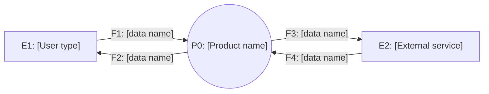
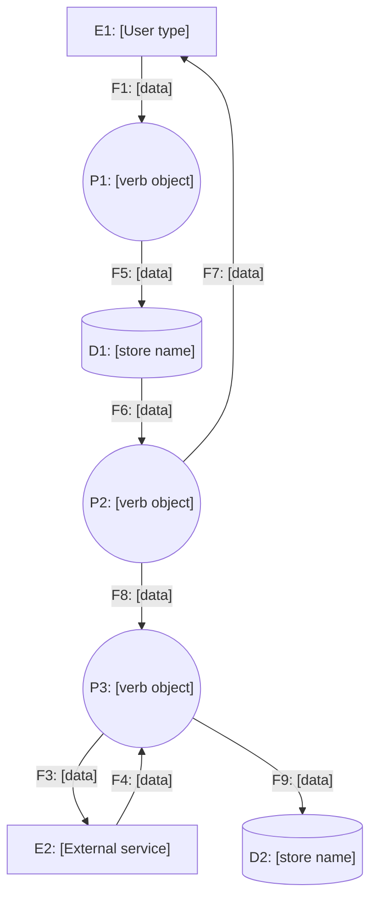
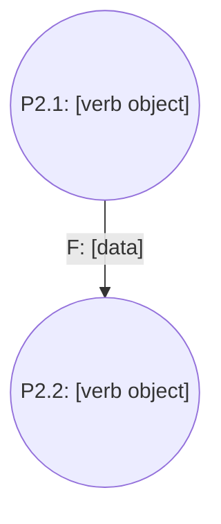
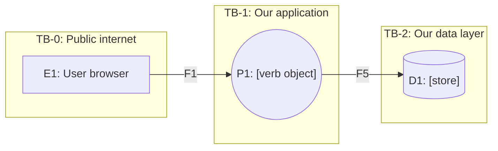

# <Product name> Data Flow Diagram

> **What this document answers:** where every piece of data comes from, where it goes, where it rests, and which boundaries it crosses. It exists so that a security review and a privacy review can be done by reading, not by guessing.
>
> **Notation:** classic structured-analysis DFD, drawn in Mermaid so it lives in version control as text.
> - **External entity** (`E`): a person or system outside our control.
> - **Process** (`P`): something that transforms data. Named `verb + object`, never a technology name.
> - **Data store** (`D`): somewhere data rests. A table, a bucket, a cache, a queue with retention.
> - **Data flow** (`F`): a labeled, directed movement of named data. Never unlabeled.
>
> **Hard rules:** data never flows store-to-store without a process between them. Every process has at least one input and one output. Every flow carries a named data item that appears in the register.

---

## 1. Level 0: context diagram

The whole system as one process. This diagram exists to fix the system boundary and nothing else.

## 2. Level 1: main processes

Decompose `P0` into the smallest set of processes that explains the system. Aim for three to seven. More than nine means the system is doing too much or the decomposition is wrong.

<!--OPTIONAL:level-2-->
## 3. Level 2: decomposition of <P-n>

Only decompose a process further when it is genuinely complex enough that a reader cannot verify its behavior from Level 1. Most systems never need this. If you find yourself drawing Level 2 for every process, the system is over-built.

<!--/OPTIONAL:level-2-->

## 4. Element register

Every element in every diagram appears here exactly once. This table, not the picture, is authoritative.

### 4.1 External entities

| ID | Name | Who or what it is | Inside our trust boundary? | Traces to |
|---|---|---|---|---|
| E1 | <name> | <plain-language description> | No | U-001 |

### 4.2 Processes

| ID | Name | What it does (one sentence) | Implemented in | Traces to |
|---|---|---|---|---|
| P1 | <verb object> | <plain language> | <container C-00x / file> | FR-001 |

### 4.3 Data stores

| ID | Name | Technology | What it holds | Classification | Retention | Encrypted at rest | Traces to |
|---|---|---|---|---|---|---|---|
| D1 | <name> | <Postgres table / bucket / cache> | <plain language> | public / internal / confidential / PII / secret | <duration + deletion trigger> | yes / no | DR-001 |

### 4.4 Data flows

| ID | From | To | Data carried | Classification | Transport | Encrypted in transit | Crosses trust boundary | Traces to |
|---|---|---|---|---|---|---|---|---|
| F1 | E1 | P1 | <named item> | PII | HTTPS | yes | yes (TB-1) | DR-001 |

## 5. Trust boundaries

A trust boundary is any line where the level of trust in the data or the caller changes. Every flow that crosses one needs a control.

| ID | Boundary | Flows crossing | Control applied | Verified by |
|---|---|---|---|---|
| TB-1 | Internet -> application | F1, F2 | <authn, input validation, rate limit> | SR-00x / T-00x |
| TB-2 | Application -> data | F5, F6 | <parameterized queries, RLS, least-privilege role> | SR-00x / T-00x |

## 6. Threat notes per boundary crossing

One row per boundary. STRIDE categories, answered in one line each. "Not applicable because <reason>" is a valid answer; blank is not.

| Boundary | Spoofing | Tampering | Repudiation | Information disclosure | Denial of service | Elevation of privilege |
|---|---|---|---|---|---|---|
| TB-1 | <control> | <control> | <control> | <control> | <control> | <control> |

## 7. Data lifecycle

For every item classified `PII`, `confidential`, or `secret`, trace it end to end.

| Data item | Created by | Stored in | Read by | Shared with | Deleted by | Deletion trigger | Traces to |
|---|---|---|---|---|---|---|---|
| <item> | P1 | D1 | P2 | E2 | <process or job> | <event or age> | DR-001 |

## 8. Change log

| Date | Version | Change | Reason | Affected IDs |
|---|---|---|---|---|

---

## Appendix A: DFD self-check (GATE-DFD)

- [ ] Every element in every diagram has a register row, and every register row appears in a diagram.
- [ ] No flow is unlabeled.
- [ ] No data store connects directly to another data store.
- [ ] Every process has at least one input flow and one output flow.
- [ ] Every flow's classification matches the classification of the data item in the PRD `DR-` table.
- [ ] Every boundary crossing has a named control and a verifying `SR-` or `T-` id.
- [ ] Every STRIDE cell is filled (a written "not applicable because..." counts).
- [ ] Every PII item has a deletion trigger.
- [ ] All Mermaid blocks render.
- [ ] No unfilled `<placeholder>` remains.
