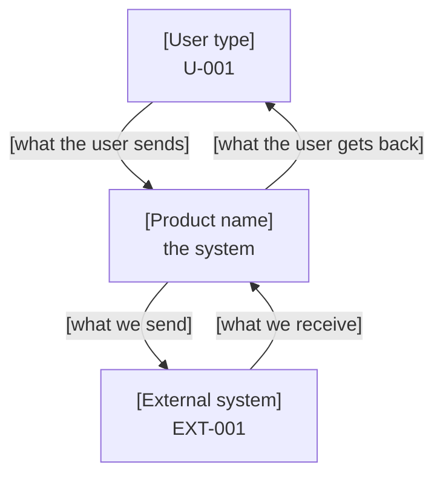
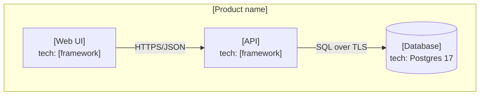

# <Product name> System Requirements

> **Relationship to the PRD.** The PRD says *what the product does and why*. This document says *what the system must be so the PRD is achievable*. Every `SR-` here derives from at least one `FR-`/`NFR-`/`DR-`/`CON-`. A system requirement with no parent is a defect: either the PRD is missing something (add it there first) or the requirement is invented (delete it).
>
> Same writing standard as the PRD: four-reader test, no adjective without a number.
>
> Component structure follows the C4 model (context, container, component). Verification methods follow standard practice: Test, Analysis, Inspection, Demonstration.

---

## 1. System context (C4 Level 1)

Who and what this system talks to. One diagram, no more.

| Element | Type | Responsibility | Traces to |
|---|---|---|---|
| <name> | person / system / external service | <one sentence> | U-001 / EXT-001 |

## 2. Containers (C4 Level 2)

A container is a separately deployable or runnable thing: a web app, an API, a database, a worker, a queue.

| ID | Container | Technology | Responsibility (one sentence) | Runs where | Traces to |
|---|---|---|---|---|---|
| C-001 | <name> | <tech + version> | <what it alone is responsible for> | <host/platform> | FR-00x |

**Rule:** a new container is a major complexity purchase. Each one must name what breaks if it is merged into an existing container.

## 3. Components (C4 Level 3, only where non-obvious)

Fill this only for containers whose internal structure is not evident from the code layout. Do not document what the directory tree already says.

| ID | Component | Inside container | Responsibility | Traces to |
|---|---|---|---|---|

## 4. System requirements

The core table. Every row is verifiable.

| ID | Requirement | Derived from | Verification method | Verified by | Status |
|---|---|---|---|---|---|
| SR-001 | The <container> must <behavior> under <condition>. | FR-001 | Test | T-I-003 | not-started |
| SR-002 | <requirement with a number in it> | NFR-001 | Analysis | <load report> | not-started |

**Verification methods (pick exactly one per row):**

| Method | Use when | Evidence produced |
|---|---|---|
| Test | Behavior can be exercised automatically | Passing `T-` id |
| Analysis | Proven by calculation or model, not execution | The calculation, written down |
| Inspection | Proven by reading code, config, or schema | The file and line |
| Demonstration | Proven by a human performing steps | Recorded checklist run |

Prefer Test. Use the others only when Test is genuinely impossible, and say why in one line.

## 5. Interfaces

### 5.1 Internal APIs

| ID | Method + path | Purpose | Request | Response | Errors | Auth | Traces to |
|---|---|---|---|---|---|---|---|
| API-001 | `POST /v1/<resource>` | <one sentence> | `{...}` | `200 {...}` | `400 <when>`, `401 <when>`, `409 <when>` | <scheme> | FR-001 |

Rules: versioned path from day one; every error code has a stated trigger condition; no endpoint exists without an `FR-`.

### 5.2 Events / messages

| ID | Event name | Producer | Consumers | Payload | Delivery guarantee | Ordering |
|---|---|---|---|---|---|---|

### 5.3 External integrations

| ID | Service | Auth method | Secret storage | Timeout | Retry policy | Behavior when unavailable | Cost model |
|---|---|---|---|---|---|---|---|
| EXT-001 | <name> | <method> | <where, never in code> | <n> s | <n> attempts, <backoff> | <degrade / fail / queue> | <$ per unit> |

## 6. Data model

Summary only. The migration files are authoritative for exact types.

| Table | Purpose | Key columns | Row growth | Retention | Traces to |
|---|---|---|---|---|---|
| <name> | <one sentence> | <pk, important fks> | <rows/month> | <DR-00x rule> | DR-001 |

**Invariants that the database enforces itself** (these are cheaper than tests, per `rules/00-CORE.md` principle 1):

| ID | Invariant | Enforced by |
|---|---|---|
| INV-001 | <statement> | `CHECK` / `UNIQUE` / `FK` / `NOT NULL` / RLS policy |

## 7. Security requirements

| Topic | Requirement | Traces to |
|---|---|---|
| Authentication | <who proves identity, how> | NFR-00x |
| Authorization | <who may do what; where the check lives> | NFR-00x |
| Row-level security | <policy per table, or "not applicable because..."> | DR-00x |
| Secrets | <where stored, how rotated, never in repo> | CON-00x |
| Transport | <TLS version floor, cert handling> | NFR-00x |
| Data at rest | <what is encrypted, with what> | DR-00x |
| Input validation | <where it happens, what schema library> | NFR-00x |
| Rate limiting | <limits per identity per window> | NFR-00x |
| Audit logging | <what events, retained how long, who can read> | NFR-00x |
| Dependency policy | <how vulnerabilities are found and patched, on what clock> | NFR-00x |

## 8. Operations

| Topic | Requirement |
|---|---|
| Environments | <list, and what differs between them> |
| Deployment | <mechanism, who can trigger, how long it takes> |
| Rollback | <exact mechanism and time to execute> |
| Migrations | <forward and down path required; how zero-downtime is achieved> |
| Backups | <frequency, retention, where> |
| Restore drill | <cadence; last successful date> |
| Monitoring | <what is watched> |
| Alerting | <what pages a human, and what does not> |
| Logging | <levels, retention, correlation ID scheme, PII exclusion rule> |
| Runbook | <link to `docs/notes/` runbook, or "none needed because..."> |

## 9. Technology decisions

One row per meaningful choice. This is the summary; a full ADR goes in `docs/adr/` when the decision is contested or expensive to reverse.

| Decision | Chosen | Alternatives rejected | Why | Reversal cost | Lock-in risk |
|---|---|---|---|---|---|
| <e.g. database> | <choice> | <A, B> | <first-principles reason> | low / medium / high | <what is proprietary> |

**Required for each row:** name the maturity cost (how battle-tested is this), the migration cost (what it takes to leave), and the ecosystem gaps (what you will have to build yourself).

## 10. Capacity and limits

| Dimension | Current | Designed ceiling | What happens at the ceiling | Next step past it |
|---|---|---|---|---|
| Concurrent users | <n> | <n> | <degradation mode> | <change required> |
| Requests / second | <n> | <n> | | |
| Database size | <n> | <n> | | |
| Cost / month | $<n> | $<n> | | |

## 11. Explicitly not built

Mirrors the PRD's non-goals at the system level. Prevents rebuild-by-drift.

| Thing | Why not | Revisit when |
|---|---|---|

## 12. Change log

| Date | Version | Change | Reason | Affected IDs |
|---|---|---|---|---|

---

## Appendix A: System Requirements self-check (GATE-SYSREQ)

- [ ] Every `SR-` derives from a PRD ID that exists.
- [ ] Every PRD `NFR-` is addressed by at least one `SR-` or explicitly deferred with a reason.
- [ ] Every `SR-` has exactly one verification method and a named evidence artifact.
- [ ] Every container justifies why it is not merged into another.
- [ ] Every external integration states its behavior when the service is down.
- [ ] Every table with PII has a stated row-level-security policy or a written reason it needs none.
- [ ] Every technology decision names maturity cost, migration cost, and lock-in.
- [ ] Both Mermaid diagrams render.
- [ ] No unfilled `<placeholder>` remains.
